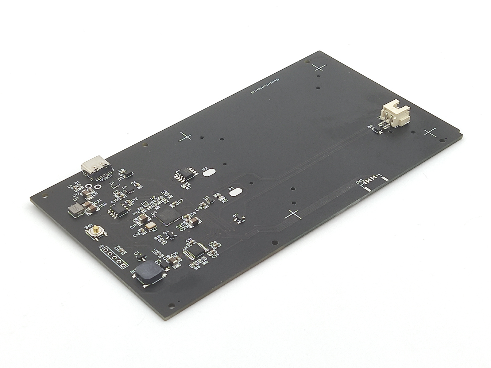
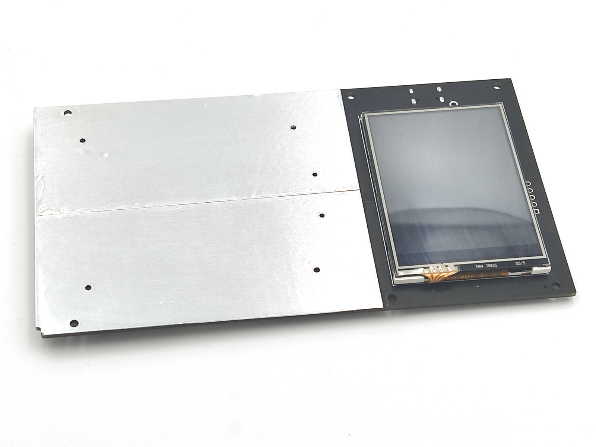
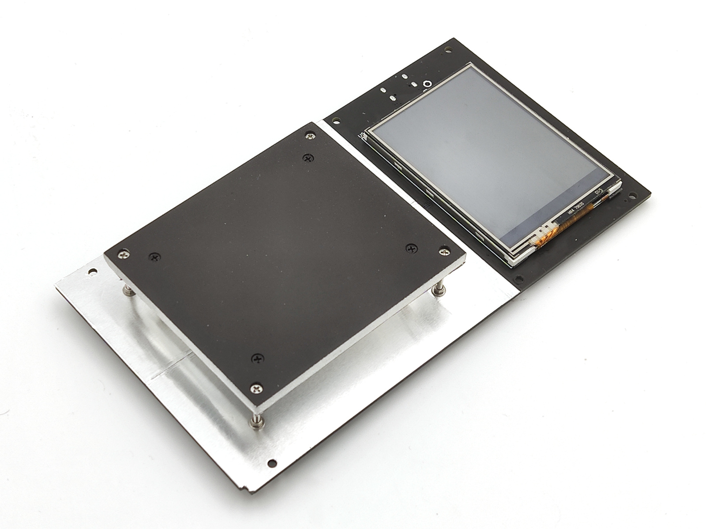

Device assembly <!-- omit in toc -->
===============

- [Required components](#required-components)
  - [General](#general)
  - [Optional](#optional)
- [Heater assembly](#heater-assembly)
- [PCB assembly](#pcb-assembly)
- [Firmware upload](#firmware-upload)
- [Case](#case)

## Required components

### General

&nbsp; | Name | Comment
-------|------|--------
1 | [PCB & Components](https://easyeda.com/reflow/reflow-micro-table) | Go to EasyEda project page and order both in couple of clicks. If you order PCB first, components second - you will be able to join delivery. Add rocker switch below to LCSC order.
2 | [2.4" Display](https://www.aliexpress.com/item/32852776943.html) | 240*320, SPI, ILI9341, touch screen.
3 | [Cooling fan 5010](https://www.aliexpress.com/item/4000194163972.html) |
4 | [22 AWG wire](https://www.aliexpress.com/item/32854919883.html) | Optional, SMT stencil positioning.
5 | [DIN965 M1.6 SS screws 20mm](https://www.aliexpress.com/item/33013472653.html) | Mount heater plate to PCB. Should be stainless steel, important!
6 | [DIN965 M1.6 black screws 8mm](https://www.aliexpress.com/item/4000217127933.html) | MCH mount
7 | [M1.6 SS washers](https://www.aliexpress.com/item/4000222547150.html) | MCH mount
8 | [M1.6 SS spring lock washers](https://www.aliexpress.com/item/4000222556028.html) | MCH mount
9 | [M2 inserts 3mm](https://www.aliexpress.com/item/4000513304304.html) | Case components mount places.
10 | [M2 flat cap screws 14mm](https://www.aliexpress.com/item/4000217127933.html) | Case assembly, cooling fan mount.
11 | [M2 Spring lock washers](https://www.aliexpress.com/item/32982630546.html) | Hinges assembly.
12 | [M2 washers](https://www.aliexpress.com/item/32859516826.html) | Hinges assembly.
13 | [M2 nuts](https://www.aliexpress.com/item/32859946901.html) | Hinges assembly, cooling fan mount.
14 | [M2 flat cap screws 8mm](https://www.aliexpress.com/item/4000217127933.html) | Hinges assembly.
15 | [Mushroom head M2 screws 5mm](https://www.aliexpress.com/item/4000168030333.html) | PCB mount.
16 | [MCH 50\*50\*2mm 150W](https://www.aliexpress.com/item/33005272347.html) | [Alternate](https://www.aliexpress.com/item/32991559341.html). Minimal power at room temp - 130W. For 110 volts buy 300W one.
17 | [Aluminium plate 4mm](https://www.aliexpress.com/item/32998175339.html) | [Alternate](https://www.aliexpress.com/item/32985318306.html).  Heater. You may also wish to buy 2mm plate for shims, if have no circular saw.
18 | Aluminum Foil 50μm (0.05mm) | Heater bottom insulation. Such foil is sold for sauna insulation. You can also try foil from baking forms.
19 | [Aluminium sticky tape](https://www.aliexpress.com/item/33036337241.html) | PCB reflector. You need fat, 50-100um tape, 30-50mm wide. Don't use cheap thin one, it will not work as needed.
20 | Temperature resistant black paint | Coating for heater top.
21 | [Thermal conductive paste](https://www.aliexpress.com/item/32870824982.html) | Should work at 300C. Don't try cheap ones.

Note. You are strongly advised to order SMT stencil for your PCB. That will
add ~ 8$ in total to your order - good price for convenience. On placing stencil
order at jlcpcb, select option "custom size", and set 160\*. Then stencil
will be compact and light, with small delivery cost.

**Important!** If you order SMT stencil, add text note to your order: "**make
stencil according to paste mask file and don't forget corner holes**".

### Optional

See [heater assembly](heater_assembly.md) docs for details. May be you already
have drill stand and so on.

&nbsp; | Name | Comment
-------|------|--------
1 | [Drill bit 1.7mm](https://www.aliexpress.com/item/33023895090.html) | 2 pcs at least, HSS Co (M35) preferable.
2 | [Drill bit 3.1mm](https://www.aliexpress.com/item/33023951160.html) | HSS Co (M35) preferable.
3 | [Miter track](https://www.aliexpress.com/item/32972951062.html) | Drilling conductor
4 | [M6 20mm philips screws](https://www.aliexpress.com/item/32854305389.html) | Drilling conductor
5 | [Aluminum heating plate](https://www.aliexpress.com/item/4000073462890.html) | Paint baking.
6 | [Dimmer](https://www.aliexpress.com/item/32818012686.html) | Regulate heating plate above.
7 | [Mini table saw](https://www.aliexpress.com/item/32845187139.html) | Cut aluminum plates.
8 | Sanding paper | 60, 120, 240, 400 grit

If you are patient enough, you can cut aluminum with hand saw. But circular
saw is much more convenient.

## Heater assembly

All details are  in [separate document](heater_assembly.md) to keep this one
compact.

That's the most boring part. Read is carefully before start making this device.

## PCB assembly

Pin SMT stencil and PCB with 22 AWG wire to silicon pad.

Apply soldering paste, place SMD components and solder all with air gun.
Inspect result and fix defects with soldering iron if needed.

Cleanup PCB from flux and place sticky aluminum type on area behind heater.
Also place any insulating type on small area behind display.

Mount display & heater.

Now everything ready to be flashed and placed into case.

## Firmware upload

TBD

## Case

TBD
