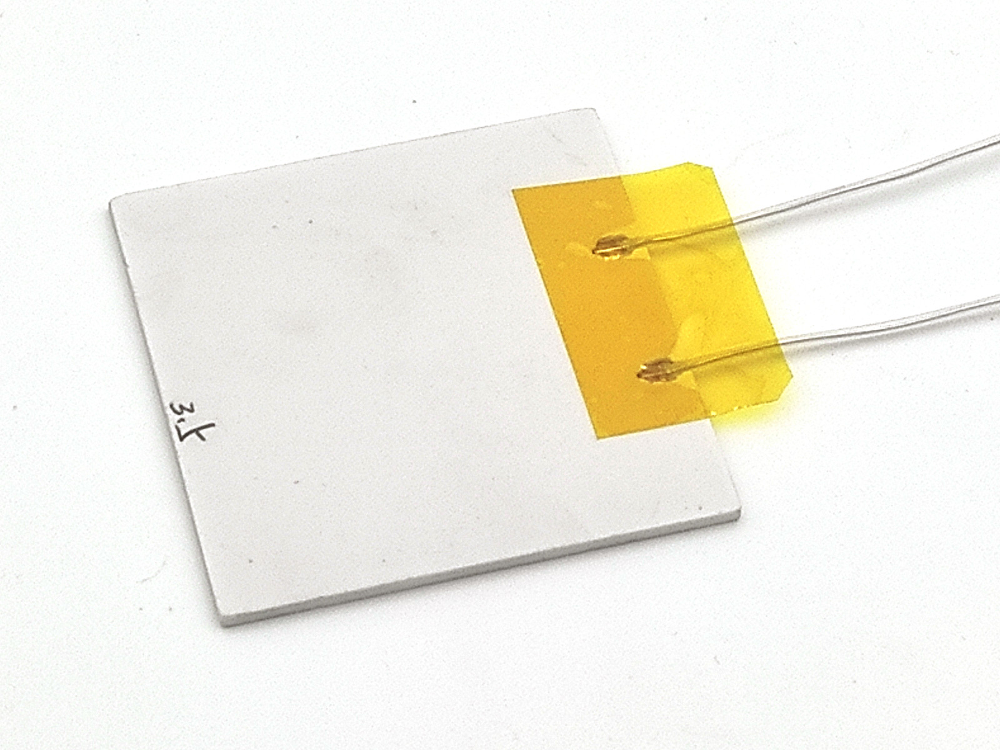

Heater assembly <!-- omit in toc -->
===============

- [Intro](#intro)
- [Make copper plate of required size](#make-copper-plate-of-required-size)
- [PCB Mount holes](#pcb-mount-holes)
- [MCH mount holes](#mch-mount-holes)
- [Cones for flat cap screws](#cones-for-flat-cap-screws)
- [Sanding](#sanding)
- [Half-shims for MCH](#half-shims-for-mch)
- [Test assembly](#test-assembly)
- [Painting](#painting)
- [Paint baking](#paint-baking)
- [MCH pads insulation](#mch-pads-insulation)
- [Final assembly](#final-assembly)

## Intro

There are 2 possible types of heaters:

- MCH-based, with copper top plate.
- Aluminum heater cartridge.

Copper has better thermal conductivity and better response. In real world this means:

- More uniform surface temperature.
- More easy to cool down (we need 4C/sec cooldown speed on reflow end).
- More flexible configurations (AC 110/220) and higher max temperatures

As perfectionists, we recommend "copper" heater. But as realists, we don't like
to reduce project availability and have "Plan B" - aluminum heater.

"Mission" of this project is to make modern electronics easy to do by
hobbyists. That means, everything should be possible to do at home, with
electric screwdriver & 3D-printer only, without machine-tools. From this
point of view, need of circular saw table is a serious disadvantage. But there
are cheap and very small [mini circular saw tables](https://www.aliexpress.com/item/32845187139.html).
Those will be enough for our needs. Only you can make a choice. Our duty is
to describe possibilities and expenses.

We describe build of both heater types in parallel. Just skip unneeded steps
for aluminum heater.

Let's go!

## Make copper plate of required size

You need 70*60mm copper plate, 2mm thick. Cut it at circular saw. If you use
mini table and have no experience, you should know:

- ADD OIL to cut line. That's important.
- Fewer big teeth are much better for copper/alu than more small teeth.
  Just use stock 80mm disk with oil.
- Train first :). Do couple of test cuts.

## PCB Mount holes

Stick copper plate (or alu heater) to PCB with sticky tape, and use PCB as
conductor to drill 1.6mm holes.

Note, copper is very inconvenient to drill. Use medium RPM and push gently.
If electric drill starts to vibrate - increase RPM until acceptable. Advices:

- HSS Co (M35) drill bits recommended. Those tend to forgive you mistakes,
  if you select too high RPM.
- Train first! Try to drill unused peace of copper plate to understand process.
- You should have 1-2 reserve 1.6mm drill bits for replace.
- Be patient, don't push too hard.

## MCH mount holes

Process is similar to above. Stick MCH to copper plate:

You need 4 holes as close as possible to MCH heater. Position drill bit to touch
MCH, with 5mm margin from corner, and drill.

## Cones for flat cap screws

Now you need to drill cones for flat caps screw. We need conductor to make those
the same and accurate. May be you will be lucky without conductor for
aluminum heater, but that's impossible for copper. Seriously, no chance
to drill nice cones "by hand" in copper, and very high probability to break
drill bit.

Note: this can be done on good drill stand, but our goal is to explain how to
succeed "at home".

Another problem is, we need cones with 3mm outer dia. There are no countersink
drill bits of such small size. So, we use 3mm chamfer milling cutter from CNC.
More expensive, but no alternative.

Let's do conductor first:

It's a U-arc with gear for 3mm shaft. Assembled with any glue (CA will be ok
too). U-arc can be done anyhow - a peace of U-profile, 2 peaces of L-profile or
even wood. You can also use [miter track](https://www.aliexpress.com/item/33048246472.html).

Optimal sizes are:

- 5-10mm of bottom space, to see hole and drill bit.
- 20-40mm width
- 150mm length

How to use:

1. Do "test" hole and cone "by hand", until satisfied with result. Check how
   screw fit in it.
2. Place conductor over it. Insert drill bit and make screwdriver chuck touch
   conductor. Now you can "clone" cones as much as you need.
3. Take conductor with plate in one hand, drill into another hand, and drill.
   This will help to "feel" process, and exclude unintended skew of screwdriver.

Result:

## Sanding

Sanding is mandatory for copper plates and recommended for aluminum heater.
Reasons are:

1. Remove artifacts after drilling.
2. Round sharp edges.
3. Prepare surface for painting.

There are to need to polish surface to mirror state. Just sand until you like
result, by hand or with orbital sander.

Note, copper plates are usually straight, but aluminum heater is usually not.
Sanding copper plate is fast, but sanding aliminum can take some time to
make it straight and nice.

## Half-shims for MCH

MCH is mounted to copper plate by edges. We need supports from another side of
screws to avoid skew. Let's do those from existing peace of copper plate.

Drill a series of 2mm holes with step 7mm and margin 3mm from border. Then, at
circular saw, cut the line and split to peaces:

Precision is not critical. Just do as you can :).

Note. MCH 50\*50mm has height exactly 2.0mm, as copper sheet. MCH 40\*40mm has
~1.7mm height - you may need to sand shim height a bit.

## Test assembly

Now worth make a partial test assembly, to check everything is ok and straight:

## Painting

It's very critical to cover heater top with [high temperature black paint](https://www.google.com/search?q=high+temperature+paint), to
increase IR emission. Difference between painted and unpainted surface is HUGE.

We can not give you exact link, but such paints should be widely available in
your local shops. They are used to protect barbecues, car exhaust systems,
furnaces, ovens and so on. Just buy the most cheap, able to work at 400C, in
aerosol pack.

- With very high probability, paint will need "baking" at 150-200C (not a
  problem, you can use heater itself to heat). Some paints don't need baking,
  but need 72Hours to full dry. Don't wait for miracle, there are no "5 min high
  temperature paint".
- Prefer paint which is more easy to use (fast dry, small pause between layers).
  Don't select by  max temperature (1000C and more), 400C is enough. Select by
  usage simplicity.
- As always... train first, if you have no practice at all!

READ PAINTING PROCESS INSTRUCTION ON AEROSOL. THAT'S IMPORTANT FOR GOOD RESULT.
Painting is not difficult, but broken process will cause poor coating quality.

We stick plates to A4 paper, to hold it in one hand, and spray paint by another
hand. 2 thin layers are enough. To pin plate, place paper sticky tape from
bottom side to cover all edges, with bounding margins. Then put that on A4 sheet
and stick again by margins.

After paint:

Then leave it to dry according to instruction, before bake.

## Paint baking

Most of high temperature paints require baking to became solid. Before that
those are soft and subject to scratches.

To bake aluminum heater - insert mounting screws and use those as trotters. Then
power via dimmer to set proper temperature. To bake copper plate - use aluminum
heater (it's cheap).

Exact baking process should be taken from manual. If it's not available - heat
at 120C until iit stops smoke, then heat at 200C several hours. To determine
end of process - use testing peace of metal, and touch it with something sharp,
to check if paint is solid or not. Preliminary estimate is 3-12 hours.

TBD [image]

As you can see, copper plate back side become oxydized. That's not a problem
in general - if you don't scratch oxidized film it will stay and stop process.
But for ideal result you may wish to sand back surface and use high temperature
thermal conductive paste on MCH to exclude any air access.

## MCH pads insulation

Since MCH has open pads and placed between metal surfaces, it's important to
make good electric insulation.

First, move wire coating "inside" ceramic body:

Now top side is safe enough. To protect bottom side, fill contacts and nearby
area with silicon gasket maker. Then wait 1 day to dry.

For sure you may add a peace of kapton (polyimide) tape (but that's not
necessary).

## Final assembly

Cut peace of aluminum foil with 1cm reserve at every edge. You need fat foil,
0.05mm (50um). Such foil is used for sauna thermal insulation, and available
in appropriate stores. If you can's find it - try foil from food baking forms
(straighten it with something round if needed).

Use copper plate to drill 4 inner holes in foil. Then apply thin layer of
thermal conductive paste and stick MCH to plate from one side with paper tape.
Assemble 2 MCH mounting screws, remove tape and assemble 2 other screws.

After MCH mounted, gently push foil copper plate. Then make 4 holes for long
screws and install those.

Now heater is ready to use. If you wish, you can glue foil border with gasket
maker, for better look - set very small points and compress with amy clip for
couple of hours. Then wait 1 day to dry.
