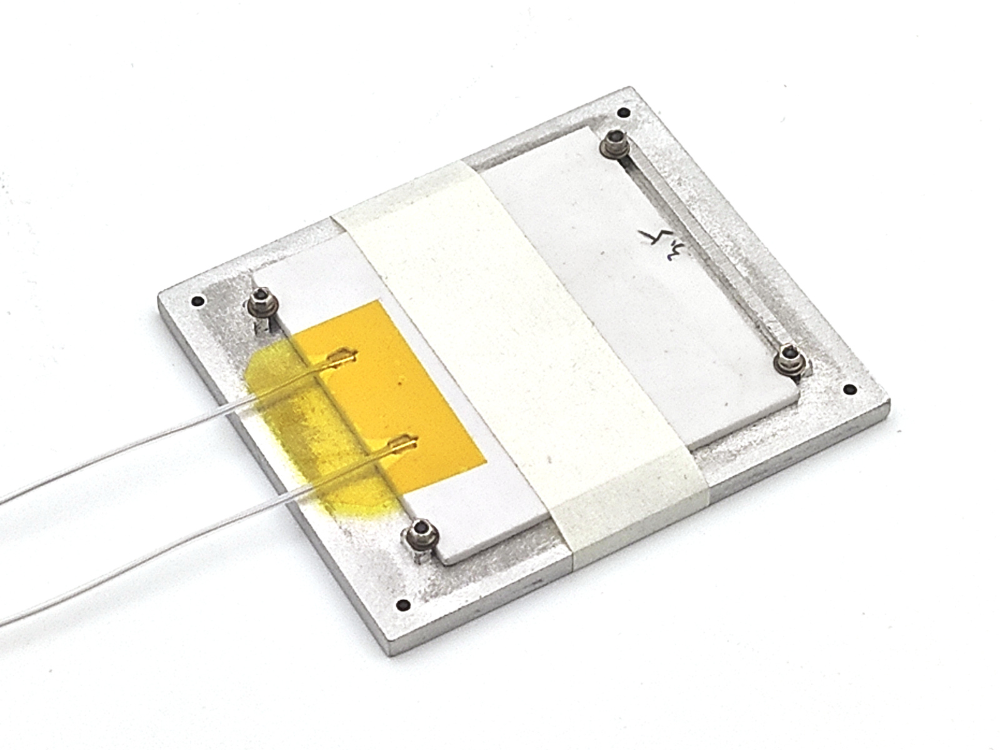
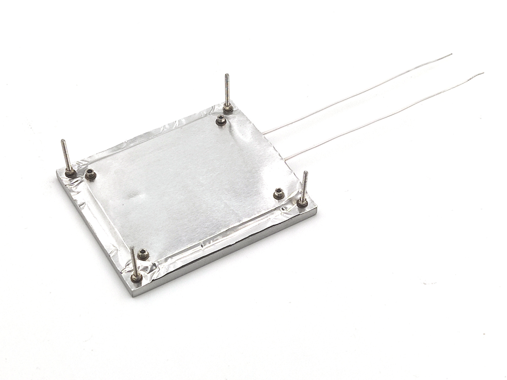

Heater assembly <!-- omit in toc -->
===============

- [Intro](#intro)
- [Drilling conductor](#drilling-conductor)
- [Drill plate](#drill-plate)
- [Half-shims for MCH mount](#half-shims-for-mch-mount)
- [Painting](#painting)
- [MCH pads insulation](#mch-pads-insulation)
- [Full assembly](#full-assembly)
- [Mount on PCB](#mount-on-pcb)

## Intro

Everything is designed with accessible materials. But we strongly recommend you
consider [mini circular saw tables](https://www.aliexpress.com/item/32845187139.html)
for easy aluminum cut. Of cause, you can cut it by hand saw, if you are patient.

Also, we recommend you build drilling conductor for ideal drill angle and depth.

## Drilling conductor

That's not mandatory, but simplifies making accurate holes for screws:

Holes are 1.7mm and 3.1mm (in M6 screws, glued with CA), for appropriate drill bits.

Tips:

1. It's not mandatory to use metal U-profile. Use anything you have,
   even wood. You can also use [miter track](https://www.aliexpress.com/item/33048246472.html).
2. To make hole in M6 screw center - put it into screwdriver, and push with
   drill bit, placed into separate chuck. Philips head is important - no need to
   search center point.
3. To simplify drilling:
    - Use the worst possible screws :). Avoid stainless steel and tempered steel.
    - Add oil to drilled point. If you don't have special one - olive oil will be
      ok.
    - HSS Co (M35, M42) drill bits are more comfortable for steel, instead of
      ordinary HSS. It's also good idea to have reserve drill bits.
4. You may need additional spacer for 3.1mm hole. Drill 2 screws.

After conductor ready, use it to make test holes on unused peace of metal.
Drill 1.7mm hole and then drill 3.1mm cone down until screw sits as needed.
Later, use this to set exact drill bit height in chuck.

## Drill plate

You need 70*60mm plate, 4mm thick. 3mm thick posible, but not recommended. Cut
it with circular or hand saw. If you use [mini table saw](https://www.aliexpress.com/item/32845187139.html)
and have no experience, you should know:

- No need to buy separate saw disc for metal, stock one is ok.
- ADD OIL to cut area. That's important.
- Train first :). Do couple of test cuts.

Stick plate to PCB with sticky tape, and drill holes to mount MCH and plate
itself. Then, set exact drill bit height from previous test samples, and make
cones for screw caps.

Note: make outer cones 1mm deeper than inner cones, to leave enougth room
between heater and PCB.

After all - sand plate to remove artefacts and improve painting quality.

If you have orbital sander - use it. Manual sanding is ok to, but takes more
time.

## Half-shims for MCH mount

MCH is mounted to plate by edges. We need supports from another side of screws
to avoid skew. Those can be done from any pease of 1.5-2.0mm metal.

Drill a series of 2mm holes with step 5mm and margin 3mm from border. Then, at
circular saw, cut the line and split to peaces:

Precision is not critical. Just do as you can :). You can also make half-shims
manually.

## Painting

It's very inportant to cover heater top with [high temperature black paint](https://www.google.com/search?q=high+temperature+paint), to
increase IR emission. Difference between painted and unpainted surface is HUGE.

We can not give you exact links, but such paints should be widely available in
your local shops. They are used to protect barbecues, car exhaust systems,
furnaces, ovens and so on. Those paints need baking at 200-250C as final step.

IMPORTANT. READ PAINTING PROCESS INSTRUCTION ON AEROSOL. THAT'S IMPORTANT FOR
GOOD RESULT.

You can stick plates with sticky tape to A4 paper. Then to hold it in one hand
and apply aerosol paint by another hand. 2 thin layers are enough.

After paint dries - bake it, according to instructions. If you wish to keep
kitchen oven clean, try [cheap heater](https://www.aliexpress.com/item/32997139401.html)
with light dimmer.

Notes:

- First time, paint smokes, that's normal.
- If you have no baking instruction - heat to 100C, then slowly (~ 5C/min)
  to 250C. And keep at max temp 1-2 hours.
- Don't touch paint while bake. It becomes very tender at start.

After baking done - sand border sides, those should not emit heat.

## MCH pads insulation

Since MCH has open pads and placed between metal surfaces, it's important to
make good electric insulation.

First, move wire coating "inside" ceramic body:

Then add 2 peaces of kapton (polyimide) tape to close pads. And from another
side, to close sticky layer and hold wire insulation.

## Full assembly

Here is how heater looks under foil:

You need a peace of aluminum foil with 1cm reserve at every edge. It shouls be
fat, 0.05mm (50um). Such foil is used for sauna thermal insulation, and available
in appropriate stores. If you can's find it - try foil from food baking forms
(straighten it with something round if needed).

Apply thermal conductive paste to plate, put heater to it's place and stick it temporary with sticky tape. Note, paste should be ok at high temperature. For
example - Thermal Grizzly Kryonaut.

Cut peace with 1cm reserve from each side and drill inner screw holed with
conductor. Screw it from one side, insert half-huts with tweezers and tighten
the screws. Then remove sticky tape and install 2 other screws in similar way.

After 4 inner screws assembled, smooth the foil, drill corner holes and install
long corner screws:

Don't forget to use spring washers everywhere. That's important to compensate
metal parts size change on heating and cooling.

## Mount on PCB

PCB should have additional reflective layer to stay cold. That's done with fat
aluminum sticky tape (0.05-0.1mm). It also help to spread heat from screws.

Cover PCB with aluminium tape under heater, with 1cm outer margin. Then clean
everything with IPA and mount assembled heater. Space between aluminium plate
and PCB should be ~13mm. Here is how it looks on standalone peace of PCB:

If everything is done right, heater can work unlimited time at 270C while
keeping PCB almost cold.